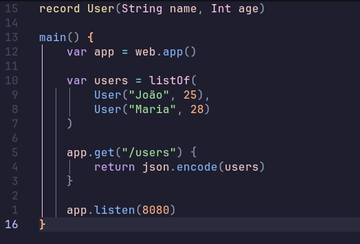

# tree-sitter-kof

[English](#english) | [Português (BR)](#português-br)



## English

Minimal Tree-sitter grammar for **syntax highlighting** of [Kof](https://koflang.github.io/learn/) (`*.kf`) in Neovim.

It only covers the syntax documented in `learn/` (chapters 03–07 and 12): functions (`main() {}`,
`Int f(Int a) {}`, `f(Int a): Int {}`, `void f() {}`), `record` (with or without a body), `var`/`val`/
typed declarations, `if`/`else`, `while`, `for`, `for (var x in xs)`, `break`, `continue`, `return`,
calls (`println(...)`, `listOf(...)`, `user.name()`), strings, numbers, `true`/`false`/`null`,
`//` and `/* */` comments, and basic operators.

Not covered: `switch`, lambdas, generics, arrays/`new`, `class`/`interface`, `package`/`import`.

### Installing in Neovim (nvim-treesitter `main` branch, Neovim 0.12+)

1. Install the tree-sitter CLI and a C compiler (nvim-treesitter uses both to build the parser).
   On Arch:

   ```sh
   sudo pacman -S tree-sitter-cli
   ```

2. Add the minimal configuration, for example in `~/.config/nvim/lua/plugins/kof.lua` (LazyVim/lazy.nvim):

   ```lua
   return {
     "nvim-treesitter/nvim-treesitter",
     init = function()
       vim.filetype.add({ extension = { kf = "kof" } })
       vim.api.nvim_create_autocmd("User", {
         pattern = "TSUpdate",
         callback = function()
           require("nvim-treesitter.parsers").kof = {
             install_info = {
               url = "https://github.com/HermesSantos/tree-sitter-kof",
               queries = "queries",
             },
           }
         end,
       })
     end,
   }
   ```

3. Restart Neovim and run:

   ```vim
   :TSInstall kof
   ```

### Testing

Open any `*.kf` file in Neovim.

- `:Inspect` with the cursor over a token shows its group (`@keyword`, `@function.call`, ...).
- `:InspectTree` shows the syntax tree.

### Development

With `tree-sitter` from pacman (or the one from `package.json`, via `npx`):

```sh
tree-sitter generate    # generates src/ from grammar.js
tree-sitter test        # runs test/corpus/
```

After changing `grammar.js`, run `tree-sitter generate`, commit and push (including `src/`) and,
in Neovim, run `:TSUpdate kof`.

To test changes without pushing, replace `url = ...` with `path = "<path to local clone>"` in the
configuration and run `:TSInstall! kof`.

---

## Português (BR)

Grammar Tree-sitter mínima para **syntax highlighting** de [Kof](https://koflang.github.io/learn/) (`*.kf`) no Neovim.

Cobre apenas a sintaxe documentada em `learn/` (capítulos 03–07 e 12): funções (`main() {}`,
`Int f(Int a) {}`, `f(Int a): Int {}`, `void f() {}`), `record` (com ou sem corpo), `var`/`val`/
declaração tipada, `if`/`else`, `while`, `for`, `for (var x in xs)`, `break`, `continue`, `return`,
chamadas (`println(...)`, `listOf(...)`, `user.name()`), strings, números, `true`/`false`/`null`,
comentários `//` e `/* */` e operadores básicos.

Não cobre: `switch`, lambdas, genéricos, arrays/`new`, `class`/`interface`, `package`/`import`.

### Instalação no Neovim (nvim-treesitter branch `main`, Neovim 0.12+)

1. Instale o CLI do tree-sitter e um compilador C (o nvim-treesitter usa os dois para compilar o parser).
   No Arch:

   ```sh
   sudo pacman -S tree-sitter-cli
   ```

2. Adicione a configuração mínima, por exemplo em `~/.config/nvim/lua/plugins/kof.lua` (LazyVim/lazy.nvim):

   ```lua
   return {
     "nvim-treesitter/nvim-treesitter",
     init = function()
       vim.filetype.add({ extension = { kf = "kof" } })
       vim.api.nvim_create_autocmd("User", {
         pattern = "TSUpdate",
         callback = function()
           require("nvim-treesitter.parsers").kof = {
             install_info = {
               url = "https://github.com/HermesSantos/tree-sitter-kof",
               queries = "queries",
             },
           }
         end,
       })
     end,
   }
   ```

3. Reinicie o Neovim e rode:

   ```vim
   :TSInstall kof
   ```

### Testar

Abra qualquer arquivo `*.kf` no Neovim.

- `:Inspect` com o cursor sobre um token mostra o grupo (`@keyword`, `@function.call`, ...).
- `:InspectTree` mostra a árvore sintática.

### Desenvolvimento

Com o `tree-sitter` do pacman (ou o do `package.json`, via `npx`):

```sh
tree-sitter generate    # gera src/ a partir de grammar.js
tree-sitter test        # roda test/corpus/
```

Depois de alterar `grammar.js`, rode `tree-sitter generate`, faça commit e push (incluindo `src/`) e,
no Neovim, `:TSUpdate kof`.

Para testar mudanças sem push, troque `url = ...` por `path = "<caminho do clone local>"` na
configuração e rode `:TSInstall! kof`.
